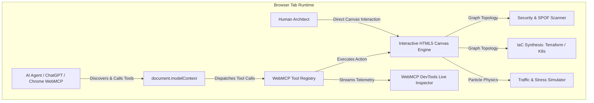

# OmniFlow Studio — Human-Agent Collaborative Visual Cloud & Systems Studio (WebMCP)

[](./LICENSE)
[](https://webmachinelearning.github.io/webmcp/)
[](https://www.nvidia.com/)
[](https://learn.chatgpt.com/docs/webmcp)
[](chrome://flags/#enable-webmcp-testing)

> **OmniFlow Studio** is a world-class visual cloud architecture and distributed systems studio where humans and AI agent swarms co-create, simulate, audit, and synthesize production infrastructure in real-time through the open **WebMCP (Web Model Context Protocol)** standard.

---

## 🌟 Executive Summary

Instead of forcing AI agents to guess visual layouts, simulate imprecise mouse clicks, or stay trapped in separate text windows, **OmniFlow Studio** registers its entire visual graph topology, NVIDIA GPU cluster engine, real-time FinOps cost calculator, traffic physics engine, security scanner, and code synthesizer directly into the browser tab via `document.modelContext.registerTool()`.

Human architects sketch and iterate on visual topologies; AI agent swarms (Architect, SecOps, Chaos Engineer, FinOps Advisor) analyze bottlenecks, execute 18,500 RPS load simulations, remediate vulnerabilities, and compile production Terraform/Kubernetes manifests using 20 structured browser tools.

---

## 🏆 Key Features & Innovations

1. **NVIDIA H100 AI Training & Inference Cluster Modeling**:
   - Native support for NVIDIA 8x H100 80GB SXM5 GPU nodes with NVLink 900 GB/s inter-GPU bus, vLLM PagedAttention inference workers, and Milvus Vector DB.

2. **Real-Time FinOps Cloud Cost Engine**:
   - Calculates real-time cloud expenditure ($/mo and $/hr) based on provisioned AWS/GCP/NVIDIA instance types and replica counts.
   - Run automated FinOps optimization to downscale idle compute and inject caching, saving ~38% on monthly cloud bills.

3. **Interactive Node Inspector Drawer**:
   - Click any component on canvas to inspect telemetry, adjust horizontal replicas, tune CPU/memory load, and switch cloud deployment regions.

4. **Multi-Agent Swarm Orchestrator**:
   - Collaborate with specialized agent roles: **Lead Architect**, **SecOps Auditor**, **FinOps Advisor**, and **Chaos Engineer**.

---

## 🏆 WebMCP Challenge Submission Details

### 1. Why is this use case a strong fit for WebMCP?
- **Active In-Browser Session State**: Cloud architecture design is inherently spatial, graph-oriented, and stateful. Traditional backend MCP servers cannot see the active canvas viewport, transient node coordinates, or live canvas selections. WebMCP allows the browser tab itself to expose interactive tools that operate directly on the user's active visual canvas.
- **Bi-Directional Co-Creation**: Rather than the agent outputting a static Markdown block of text, the agent calls `create_node`, `connect_nodes`, and `simulate_traffic`, causing the visual canvas in front of the human user to update in real-time at 60 FPS.
- **Safety Boundaries**: Using WebMCP's standard hints (`readOnlyHint: true` for `inspect_canvas_state`, `run_security_audit`, `generate_infrastructure_code` vs mutating tools like `batch_build_architecture`), the browser enforces clear trust boundaries.

### 2. How does it create a better user experience?
- **No More Hallucinated Coordinates or Clunky Screenshots**: Agents invoke atomic tools with strict JSON schemas, ensuring 100% reliable system topology construction.
- **Real-Time Visual Telemetry**: Simulated traffic stress tests render animated glowing packets flowing across connections with dynamic request rate (RPS), latency heatmaps, and bottleneck alerts.
- **Instant DevTools Observability**: The built-in **WebMCP Live Inspector HUD** gives users and judges a complete real-time view of all 16 registered tools, JSON input schemas, execution counts, average latency, and a manual tool test runner.

### 3. What can humans and agents do together that was difficult or impossible before?
| Capability | Before WebMCP (Screen Parsing / Chat) | With OmniFlow Studio & WebMCP |
| :--- | :--- | :--- |
| **System Architecture Synthesis** | Human draws manually or agent generates ASCII art / text lists. | Agent calls `batch_build_architecture` or `create_node`, instantly building interactive 2D node graphs. |
| **Traffic Stress Testing** | Static theoretical estimates in text. | Agent triggers `simulate_traffic`, rendering live particle physics and bottleneck telemetry on the canvas. |
| **Vulnerability Remediation** | Manual copy-pasting of security advice. | Agent calls `run_security_audit`, identifies single points of failure (SPOF) or exposed DBs, and applies `optimize_architecture` fixes with 1 click. |
| **Infrastructure as Code (IaC)** | Disconnected manual templates. | Atomic synthesis of Terraform, Docker Compose, and Kubernetes YAML directly from the live graph topology. |

---

## 🛠️ WebMCP Implementation Architecture

OmniFlow Studio implements both the **Imperative JavaScript API** (`document.modelContext.registerTool`) and the **Declarative HTML Form API** (`<form toolname="...">`).



### Complete Registered Tool Suite

| Tool Name | Type | Safety Hint | Description |
| :--- | :--- | :--- | :--- |
| `inspect_canvas_state` | Imperative | `readOnlyHint: true` | Returns complete node topology, health scores, CPU/MEM telemetry, and connection matrices. |
| `create_node` | Imperative | State Mutating | Creates an architecture node (Gateway, Microservice, Database, Redis Cache, Kafka, LLM Model, Vector DB, S3, Auth). |
| `delete_node` | Imperative | State Mutating | Deletes a node and cleans up connected links. |
| `connect_nodes` | Imperative | State Mutating | Connects two nodes with protocol tagging (gRPC, HTTPS, Kafka, Redis TCP, PostgreSQL) and latency. |
| `disconnect_nodes` | Imperative | State Mutating | Removes a link between two nodes. |
| `batch_build_architecture`| Imperative | State Mutating | Atomically constructs an entire multi-tier system topology in a single transaction. |
| `simulate_traffic` | Imperative | State Mutating | Initiates real-time packet particle simulation with configurable RPS and bottleneck detection. |
| `stop_simulation` | Imperative | State Mutating | Halts active traffic stress simulation. |
| `run_security_audit` | Imperative | `readOnlyHint: true` | Scans canvas for OWASP/Cloud Security risks (public DB exposure, missing IAM gateway, SPOFs). |
| `optimize_architecture` | Imperative | State Mutating | Applies architectural refactorings for latency, cost, security, or high-availability. |
| `generate_infrastructure_code`| Imperative | `readOnlyHint: true` | Generates Terraform (`main.tf`), Docker Compose, Kubernetes YAML, and TypeScript manifests. |
| `apply_layout_preset` | Imperative | State Mutating | Auto-organizes nodes using hierarchical tiered alignment. |
| `load_architecture_template` | Imperative | State Mutating | Loads curated blueprints (`ecommerce`, `rag-pipeline`, `fintech`, `streaming`). |
| `clear_canvas` | Imperative | State Mutating | Resets and clears the canvas. |
| `quick_add_component` | Declarative | Form Tool | HTML `<form toolname="quick_add_component">` for declarative component insertion. |
| `trigger_quick_optimization` | Declarative | Form Tool | HTML `<form toolname="trigger_quick_optimization">` for declarative optimization trigger. |

---

## 🚀 Quickstart & Local Setup

### Prerequisites
- Node.js 18+ and npm

### Installation
```bash
# Clone the repository
git clone https://github.com/your-username/omniflow-studio-webmcp.git
cd omniflow-studio-webmcp

# Install dependencies
npm install

# Start local development server
npm run dev
```

Open [http://localhost:3000](http://localhost:3000) in your browser.

---

## 🧪 Testing with WebMCP

### 1. Google Chrome 149+ (with Experimental Flag)
1. Open Google Chrome.
2. Navigate to `chrome://flags/#enable-webmcp-testing`.
3. Set the flag to **Enabled** and restart Chrome.
4. Open the deployed application or `http://localhost:3000`.
5. Open Chrome DevTools (`F12` or `Ctrl+Shift+I`) → Inspect registered tools in the WebMCP panel or console via `document.modelContext.listTools()`.

### 2. ChatGPT In-App Browser & ChatGPT Sites
1. Deploy OmniFlow Studio to any static host (Vercel, Netlify, Cloudflare Pages, Render).
2. Open the live URL inside ChatGPT's in-app browser.
3. ChatGPT's native agent will automatically discover registered tools on `document.modelContext` and can be prompted to manipulate the canvas directly.

### 3. Built-In Agent Co-Pilot (Universal Testing in Any Browser)
- Click the **Agent Co-Pilot** button in the top right.
- Try prompt suggestions such as:
  - *"Build an AI RAG pipeline with FastAPI Gateway, Milvus Vector DB, Redis Cache, and Claude 3.7 LLM, then simulate 6,000 RPS traffic."*
  - *"Audit this architecture for security vulnerabilities and auto-remediate any single points of failure."*
  - *"Optimize this topology for low latency and generate Terraform HCL."*
- Watch the live tool execution trace stream and observe the canvas updating synchronously.

### 4. Built-In WebMCP Live Inspector DevTools HUD
- Click **WebMCP HUD** in the top navigation bar to inspect registered tools, view parameter JSON schemas, monitor real-time execution latency, and execute manual tests with custom JSON payloads.

---

## 🚢 Deployment Guide (Powered by Render)

OmniFlow Studio is fully client-side and zero-dependency at runtime, pre-configured for **1-click deployment on Render**:

### Deploy on Render (Recommended)
1. Push your repository to GitHub / GitLab.
2. Go to your [Render Dashboard](https://dashboard.render.com/).
3. Click **New +** → **Blueprint** (or **Static Site**).
4. Connect your repository. Render automatically reads [`render.yaml`](./render.yaml) and deploys your site!

#### Manual Static Site Settings on Render:
- **Build Command**: `npm install && npm run build`
- **Publish Directory**: `dist`
- **Rewrite Rules**: `/*` → `/index.html`

### Alternative Providers
- **Netlify**: `npm run build && npx netlify deploy --prod --dir=dist`
- **Cloudflare Pages**: `npm run build && npx wrangler pages deploy dist --project-name=omniflow-studio`

---

## 📂 Project Structure

```
omniflow-studio-webmcp/
├── index.html                   # Semantic HTML entry with declarative WebMCP forms
├── package.json                 # Project manifest & scripts
├── vite.config.js               # Vite build configuration
├── LICENSE                      # Official MIT Open Source License
├── README.md                    # Comprehensive documentation & testing guide
├── SUBMISSION.md                # Devpost submission copy-paste answers
├── DEMO_SCRIPT.md               # 3-minute demo video script
└── src/
    ├── app.js                   # Application bootstrap & event orchestration
    ├── styles/
    │   └── index.css            # Dark glassmorphic design system
    ├── webmcp/
    │   ├── webmcp-core.js       # Standard WebMCP polyfill, registry & event bus
    │   └── tools.js             # 14+ Imperative WebMCP tool registrations
    ├── canvas/
    │   ├── canvas-engine.js     # 60 FPS Interactive HTML5 Canvas Engine
    │   ├── traffic-simulator.js # Real-time particle stress & bottleneck physics
    │   ├── security-scanner.js  # OWASP & SPOF vulnerability audit engine
    │   ├── iac-generator.js     # Terraform, Docker Compose & K8s synthesizer
    │   └── templates.js         # Curated architectural blueprints
    └── components/
        ├── agent-copilot.js     # Human-Agent interactive chat & tool tracer
        ├── hud-inspector.js     # WebMCP DevTools Live Inspector HUD
        ├── code-modal.js        # Multi-language IaC export viewer
        ├── audit-panel.js       # Security report & 1-click remediation
        └── declarative-forms.js # Declarative WebMCP forms manager
```

---

## 📄 Open Source License

This project is licensed under the **MIT License** — see the [LICENSE](./LICENSE) file for details.
