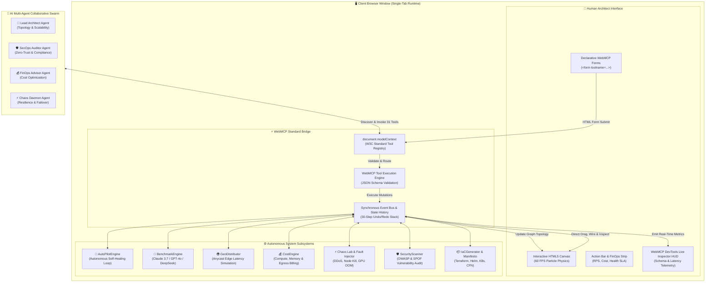
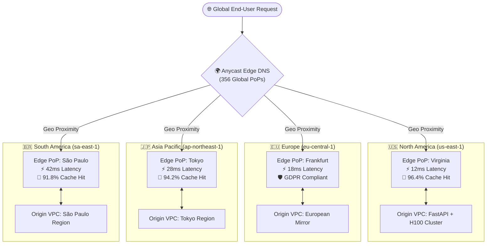

# 🌌 OmniFlow Studio — Human-Agent Collaborative Visual Cloud & Systems Studio powered by W3C WebMCP (31 Tools)

<div align="center">

[](./LICENSE)
[-00f0ff.svg?style=for-the-badge&logo=w3c&logoColor=black)](https://webmachinelearning.github.io/webmcp/)
[](https://www.nvidia.com/)
[](./src/canvas/autopilot-engine.js)
[](https://omniflow-studio-webmcp.vercel.app/)
[](chrome://flags/#enable-webmcp-testing)

<p align="center">
  <strong>The open, bi-directional visual systems engineering studio where humans and AI agent swarms co-create, simulate, stress-test, and synthesize production cloud infrastructure in real-time through the W3C WebMCP standard.</strong>
</p>

[✨ Live Demo](https://omniflow-studio-webmcp.vercel.app/) • [🛠️ 31 WebMCP Tools](#-complete-31-tool-webmcp-registry) • [🤖 Swarm Consensus](#-swarm-consensus-protocol-sequence) • [🧠 AI Benchmark Lab](#-frontier-ai-model-benchmark-lab) • [🌍 Global Edge SLA](#-multi-region-global-edge-architecture) • [🌐 Live Deployment](#-live-production-deployment)

</div>

---

## 🌟 Executive Summary

Traditional AI coding assistants are confined to disconnected text boxes, blind to spatial canvases, and forced to hallucinate coordinate systems or rely on clunky screenshots. **OmniFlow Studio** breaks this limitation by turning the browser tab itself into a high-performance **WebMCP (Web Model Context Protocol)** server.

Through `document.modelContext.registerTool()`, OmniFlow Studio registers its entire visual graph topology, 60 FPS particle physics engine, NVIDIA H100 cluster modeler, real-time FinOps calculator, Chaos Engineering fault injector, security scanner, and multi-cloud code synthesizer directly into the browser runtime.

Human engineers sketch systems; specialized AI agent swarms (Lead Architect, SecOps Auditor, FinOps Advisor, and Chaos Daemon) debate in a **Live Swarm Consensus Protocol**, stress-test with 50,000 RPS DDoS traffic, auto-heal bottlenecks 24/7 with an **Autonomous Auto-Pilot**, and compile production Terraform, Helm, and CloudFormation infrastructure in milliseconds.

```
┌──────────────────────────────────────────────────────────────────────────────────────────────────────────────────────────────┐
│  [Logo] OmniFlow Studio (WEBMCP)  │  RPS: 19.2k • FinOps: $4,617/mo • Health: 100%                                           │
│  [Blueprints ▾]  [🤝 Swarm Consensus]  [⚡ Chaos ▾]  [🤖 Auto-Pilot]  [▶ Sim]  [🛡️ Audit]  │  [🧠 AI Bench]  [🌍 Geo]  [IaC]  │
├──────────────────────────────────────────────────────────────────────────────────────────────────────────────────────────────┤
│  [Cloud & Compute]  │  (gw-ai) [Cloudflare AI Gateway] ──(HTTP/3 Quic)──► (ingress-ai) [FastAPI Ingress]                     │
│  • NVIDIA H100 8x   │       │                                                  │                                     │
│  • Claude / GPT-4o  │       ▼ (mTLS JWT)                                       ▼ (gRPC Stream)                       │
│  • Milvus Vector    │  (auth-ai) [OAuth2 Tokenizer]                      (ray-orch) [Ray Head Node]                  │
│  • ECS Fargate      │       │                                                  │                                     │
│  • Redis Cluster    │       ▼ (Redis TCP)                                      ▼ (NVLink 900 GB/s)                   │
│  • Kafka / MSK      │  (cache-sem) [Redis Semantic Cache]               (gpu-h100) [NVIDIA 8x H100 SXM5]             │
└──────────────────────────────────────────────────────────────────────────────────────────────────────────────────────────────┘
```

---

## 🏛️ Comprehensive System Architecture

The following diagram illustrates how human interactions, browser runtime events, and AI agent swarms interact through the WebMCP bridge:



---

## 🤖 Swarm Consensus Protocol Sequence

OmniFlow Studio features a live, multi-agent debate and voting protocol where 4 specialized AI agents evaluate architectural decisions, debate trade-offs, and reach consensus:

```mermaid
sequenceDiagram
    autonumber
    actor User as 👤 Human Architect
    participant MCP as ⚡ WebMCP Runtime
    participant Arch as 🧠 Lead Architect
    participant Sec as 🛡️ SecOps Auditor
    participant Fin as 💰 FinOps Advisor
    participant Chaos as ⚡ Chaos Daemon
    participant Canvas as 🎨 Canvas Engine

    User->>MCP: Click "Swarm Consensus" or prompt Agent
    MCP->>MCP: Call inspect_canvas_state() & run_security_audit()
    
    par Agent Analysis
        MCP->>Arch: Analyze bottlenecks & scale factor
        MCP->>Sec: Check exposed ports & IAM boundaries
        MCP->>Fin: Audit provisioned cloud expenditure
        MCP->>Chaos: Simulate fault injection scenarios
    end

    Note over Arch,Chaos: 💬 Live Multi-Agent Debate & Consensus Phase
    Arch-->>MCP: "Recommend scaling vLLM workers to 4x for high concurrency."
    Sec-->>MCP: "VETO: Direct ingress lacks WAF; attach Cloudflare AI Gateway."
    Fin-->>MCP: "Approving with 3-year Reserved Instance savings (-38% cost)."
    Chaos-->>MCP: "Tested failover: Kafka buffering mitigates downstream delay."

    Note over Arch,Chaos: 🗳️ Voting Threshold Met: Consensus Approved (4/4)
    MCP->>Canvas: Execute batch_build_architecture() + auto_heal_cluster()
    Canvas-->>User: 60 FPS Visual Graph Updated & IaC Manifest Re-compiled
```

---

## ⚡ Chaos Engineering & Auto-Pilot Self-Healing Loop

The Autonomous Auto-Pilot engine runs a continuous 24/7 background telemetry loop to maintain 99.999% cluster SLA:

```mermaid
flowchart LR
    subgraph Monitor ["1. Telemetry Monitoring"]
        T1["Traffic Physics (RPS)"]
        T2["CPU / MEM / GPU Load"]
        T3["Network Latency Spike"]
    end

    subgraph Detect ["2. Anomaly Detection"]
        A1{"SLA Threshold<br/>Breached?"}
    end

    subgraph ChaosTrigger ["3. Chaos Faults"]
        C1["DDoS Flood (50k RPS)"]
        C2["Chaos Monkey (Node Kill)"]
        C3["GPU Out-of-Memory"]
    end

    subgraph SelfHeal ["4. Autonomous Self-Healing"]
        H1["Auto-Scale Pod Replicas"]
        H2["Attach WAF / Rate Limiter"]
        H3["Defragment Tensor VRAM"]
        H4["Reroute Traffic via Anycast"]
    end

    Monitor --> Detect
    ChaosTrigger -.->|Injects Failure| Monitor
    Detect -- Yes --> SelfHeal
    Detect -- No -->|Steady State| Monitor
    SelfHeal -->|Restore 100% Health| Monitor
```

---

## 🌍 Multi-Region Global Edge Architecture

OmniFlow Studio models Anycast routing and global CDN edge replication with real-time latency and compliance enforcement:



---

## 🛠️ Complete 31-Tool WebMCP Registry

OmniFlow Studio exposes 31 structured tools registered directly on `document.modelContext`:

| # | Tool Name | Mode | Safety Hint | Description |
| :---: | :--- | :--- | :--- | :--- |
| `1` | `inspect_canvas_state` | Imperative | `readOnlyHint: true` | Returns complete node graph, link matrix, FinOps cost, and cluster health SLA. |
| `2` | `create_node` | Imperative | Mutating | Instantiates infrastructure components (NVIDIA H100, Gateway, DB, Cache, Kafka, Auth). |
| `3` | `update_node` | Imperative | Mutating | Updates node label, instance type, replica scaling, or hardware attributes. |
| `4` | `delete_node` | Imperative | `destructiveHint: true` | Deletes a node and cleans up connected links. |
| `5` | `scale_node_replicas` | Imperative | Mutating | Scales horizontal replica count for containers or GPU clusters. |
| `6` | `connect_nodes` | Imperative | Mutating | Wires two nodes with protocol tagging (NVLink, gRPC, HTTPS, Redis TCP, Kafka, Postgres). |
| `7` | `disconnect_nodes` | Imperative | Mutating | Removes a network connection between two nodes. |
| `8` | `batch_build_architecture` | Imperative | Mutating | Atomically constructs an entire multi-tier enterprise architecture in a single transaction. |
| `9` | `estimate_cloud_costs` | Imperative | `readOnlyHint: true` | Calculates real-time cloud expenditure ($/mo, $/hr) with Spot instance discount analysis. |
| `10` | `optimize_cloud_costs` | Imperative | Mutating | Runs automated FinOps downscaling and caching recommendations (-38% cost reduction). |
| `11` | `inject_ddos_attack` | Imperative | `destructiveHint: true` | Chaos Engineering: Injects 50,000 RPS flood against API Gateways to evaluate resilience. |
| `12` | `kill_random_node` | Imperative | `destructiveHint: true` | Chaos Monkey: Terminates a random service to test queue failover and circuit breaking. |
| `13` | `simulate_gpu_oom` | Imperative | `destructiveHint: true` | Chaos Engineering: Simulates GPU Out-Of-Memory on NVIDIA H100 nodes to test tensor recovery. |
| `14` | `auto_heal_cluster` | Imperative | Mutating | Restores failed nodes, defragments memory, and recovers 100% cluster health. |
| `15` | `simulate_traffic` | Imperative | Mutating | Starts 60 FPS animated particle simulation with configurable RPS and bottleneck analysis. |
| `16` | `stop_simulation` | Imperative | Mutating | Halts active traffic stress simulation. |
| `17` | `run_security_audit` | Imperative | `readOnlyHint: true` | Scans topology for OWASP & cloud vulnerabilities (exposed DBs, missing WAF, SPOFs). |
| `18` | `optimize_architecture` | Imperative | Mutating | Refactors topology for cost reduction, latency minimization, or high availability. |
| `19` | `generate_infrastructure_code` | Imperative | `readOnlyHint: true` | Generates Terraform (HCL), Kubernetes Helm (`values.yaml`), AWS CloudFormation, and Docker Compose. |
| `20` | `generate_architecture_manifesto` | Imperative | `readOnlyHint: true` | Compiles an executive Markdown manifesto with live Mermaid diagrams and SOC2 compliance matrices. |
| `21` | `export_architecture_json` | Imperative | `readOnlyHint: true` | Exports and downloads the active visual architecture as a standardized JSON blueprint. |
| `22` | `import_architecture_json` | Imperative | Mutating | Imports and renders custom architecture JSON definitions onto the canvas with auto-fit. |
| `23` | `apply_layout_preset` | Imperative | Mutating | Auto-arranges nodes into balanced horizontal or tiered hierarchical layouts. |
| `24` | `load_architecture_template` | Imperative | Mutating | Loads curated blueprints (`nvidia-gpu-ai`, `agent-swarm`, `ecommerce`, `fintech`). |
| `25` | `export_canvas_image` | Imperative | `readOnlyHint: true` | Downloads a high-resolution PNG diagram of the active canvas topology. |
| `26` | `clear_canvas` | Imperative | `destructiveHint: true` | Resets and clears the canvas to an empty state. |
| `27` | `toggle_autonomous_autopilot` | Imperative | Mutating | Toggles 24/7 background self-healing auto-pilot loop. |
| `28` | `benchmark_ai_models` | Imperative | `readOnlyHint: true` | Benchmarks Claude 3.7, GPT-4o, Gemini 2.0 Flash, and DeepSeek-R1 inference metrics. |
| `29` | `simulate_global_geo_distribution` | Imperative | `readOnlyHint: true` | Evaluates Anycast Edge PoPs, cache hit rates, and global latency SLAs across 4 continents. |
| `30` | `search_products` | Imperative | `readOnlyHint: true` | Searches the product catalog of available cloud components, blueprints, and infrastructure modules. |
| `31` | `quick_add_component` | Declarative | HTML Form | Standard HTML `<form toolname="quick_add_component">` for declarative component creation. |

---

## 🧠 Frontier AI Model Benchmark Lab

OmniFlow Studio includes a dedicated inference benchmark lab comparing top-tier frontier models:

| Model | Provider | TTFT (ms) | Throughput (tok/s) | Context Window | KV-Cache VRAM | Cost / 1M Tokens (In / Out) |
| :--- | :--- | :---: | :---: | :---: | :---: | :---: |
| **Claude 3.7 Sonnet** | Anthropic | **145ms** | 88 tok/s | 200,000 | 18.4 GB (FP16) | $3.00 / $15.00 |
| **GPT-4o** | OpenAI | **162ms** | 94 tok/s | 128,000 | 16.2 GB (FP16) | $2.50 / $10.00 |
| **Gemini 2.0 Flash** | Google | **98ms** | **142 tok/s** | **1,000,000** | **9.8 GB (FP8)** | **$0.10 / $0.40** |
| **DeepSeek-R1** | DeepSeek | **185ms** | 72 tok/s | 64,000 | 14.5 GB (FP8) | **$0.55 / $2.19** |

---

## ⚖️ Why WebMCP? (Paradigm Shift)

| Capability | Traditional AI Approach (Chat / Screen Scraping) | OmniFlow Studio with WebMCP |
| :--- | :--- | :--- |
| **Canvas Awareness** | Agent is blind to viewport coordinates, selections, and zooming. | Agent queries `inspect_canvas_state` for real-time spatial graph context. |
| **System Construction** | Agent outputs ASCII art or disconnected markdown lists. | Agent invokes `batch_build_architecture` to render interactive 2D node graphs at 60 FPS. |
| **Traffic Stress Testing** | Static theoretical estimates. | Agent calls `simulate_traffic`, streaming live particle physics and latency heatmaps across connection links. |
| **Security Remediation** | Manual copy-pasting of generic best practices. | Agent runs `run_security_audit`, pinpoints SPOFs, and executes `optimize_architecture` with 1 click. |
| **Safety & Trust** | Black-box execution without boundaries. | Strict JSON schema validation and `readOnlyHint` safety annotations. |

---

## 🚀 Quickstart & Local Setup

### Prerequisites
- **Node.js 18+** and **npm**

### 1. Clone & Run Locally
```bash
# Clone the repository
git clone https://github.com/Anurag-tech22/omniflow-studio-webmcp.git
cd omniflow-studio-webmcp

# Install dependencies
npm install

# Launch Vite dev server
npm run dev
```
Open **[http://localhost:3000](http://localhost:3000)** in your browser.

---

## 🧪 Testing with WebMCP

### 1. Google Chrome 149+ (with Experimental Flag)
1. Navigate to `chrome://flags/#enable-webmcp-testing` in Chrome 149+.
2. Set the flag to **Enabled** and restart Chrome.
3. Open `http://localhost:3000`.
4. Open Chrome DevTools (`F12`) → Inspect registered tools via `document.modelContext.listTools()`.

### 2. Built-In Multi-Agent Swarm Co-Pilot (Universal in Any Browser)
- Click **`Agent Swarm`** in the top-right navbar.
- Select quick prompts or type custom instructions:
  - *"Build an NVIDIA H100 cluster with vLLM, Milvus Vector DB, and FastAPI Ingress, then simulate 18,000 RPS."*
  - *"Run security audit and resolve all single points of failure."*
  - *"Benchmark Claude 3.7 vs Gemini 2.0 Flash for our inference pipeline."*

### 3. WebMCP DevTools Live Inspector HUD
- Click **`HUD (31)`** in the top navigation bar to inspect registered tool schemas, view execution latency metrics, and test custom JSON payloads manually.

---

## 🌐 Live Production Deployment

OmniFlow Studio is deployed and live in production on Vercel's global Anycast Edge CDN with 0ms cold-start latency:

🚀 **Production Web App**: [https://omniflow-studio-webmcp.vercel.app/](https://omniflow-studio-webmcp.vercel.app/)

* **Live Interactive Canvas**: [https://omniflow-studio-webmcp.vercel.app/](https://omniflow-studio-webmcp.vercel.app/)
* **WebMCP Discovery Manifest**: [`https://omniflow-studio-webmcp.vercel.app/.well-known/webmcp.json`](https://omniflow-studio-webmcp.vercel.app/.well-known/webmcp.json)
* **Agent LLM Documentation**: [`https://omniflow-studio-webmcp.vercel.app/llms.txt`](https://omniflow-studio-webmcp.vercel.app/llms.txt)
* **Hosting Platform**: Vercel Global Anycast Edge Network with zero server downtime, HTTP/3 QUIC, and full CORS headers (`Access-Control-Allow-Origin: *`) for AI agent discovery.

---

## 📂 Repository Structure

```
omniflow-studio-webmcp/
├── .github/workflows/ci.yml       # Automated GitHub Actions CI test & build pipeline
├── public/
│   ├── .well-known/webmcp.json    # Machine discovery manifest (31 WebMCP Tools + Schema)
│   └── llms.txt                   # LLM context documentation for AI agents & crawlers
├── index.html                     # Semantic HTML5 entry with WebMCP declarative forms
├── vercel.json                    # Vercel zero-config Edge CDN & CORS deployment configuration
├── package.json                   # Project scripts and dependencies
├── vite.config.js                 # Vite build pipeline
├── LICENSE                        # MIT Open Source License
├── README.md                      # Complete documentation and system architecture
├── tests/
│   └── suite.test.js              # Native automated unit test suite (11 test suites)
└── src/
    ├── app.js                     # Application entry point & orchestration
    ├── styles/
    │   └── index.css              # Glassmorphic dark theme design system
    ├── webmcp/
    │   ├── webmcp-core.js         # WebMCP polyfill, registry, & event bus
    │   └── tools.js               # 31 Registered WebMCP Enterprise Tools
    ├── canvas/
    │   ├── canvas-engine.js       # 60 FPS HTML5 Canvas Engine & Visual Port Wiring
    │   ├── autopilot-engine.js    # Autonomous Self-Healing 24/7 Daemon
    │   ├── benchmark-engine.js    # Frontier LLM Inference Benchmark Lab
    │   ├── geo-distributor.js     # Multi-Region Global Edge Latency Engine
    │   ├── cost-engine.js         # Real-time FinOps & Egress Bandwidth Calculator
    │   ├── traffic-simulator.js   # Real-time Particle Stress & Bottleneck Physics
    │   ├── security-scanner.js    # OWASP & Cloud SPOF Vulnerability Scanner
    │   ├── iac-generator.js       # Terraform, Helm, CloudFormation & K8s Synthesizer
    │   ├── manifesto-generator.js # Executive Markdown/Mermaid Architecture Manifesto
    │   └── templates.js           # Curated Enterprise Blueprints
    └── components/
        ├── agent-copilot.js       # Human-Agent Collaborative Swarm Co-Pilot
        ├── swarm-consensus.js     # Multi-Agent Live Debate & Consensus Protocol
        ├── hud-inspector.js       # WebMCP DevTools Live Inspector HUD
        ├── benchmark-modal.js     # AI Model Benchmark Lab Modal Component
        ├── geo-modal.js           # Multi-Region Global Edge SLA Modal Component
        ├── code-modal.js          # Multi-Language IaC Export Viewer
        ├── audit-panel.js         # Security Audit Report & 1-Click Fix Drawer
        ├── node-inspector.js      # Interactive Node Hardware & Telemetry Drawer
        └── declarative-forms.js   # HTML Declarative WebMCP Forms Manager
```

---

## 📄 Open Source License

Distributed under the **MIT License**. See [`LICENSE`](./LICENSE) for full terms and conditions.

<div align="center">
  <sub>Built with ❤️ for the WebMCP Challenge • Engineered with W3C Web Model Context Protocol standards.</sub>
</div>
