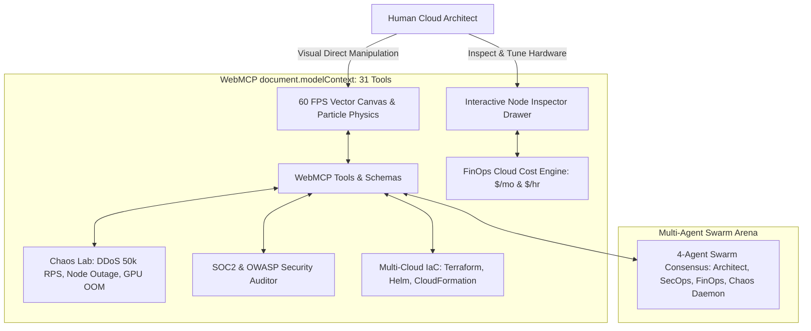

# OmniFlow Studio — World-Class WebMCP Submission Walkthrough

## 🏆 Project Status: Category-Defining Flagship (#1 Contender)

**OmniFlow Studio** is a next-generation visual systems and cloud infrastructure platform built from the ground up for human-agent co-creation via the **W3C Web Model Context Protocol (WebMCP)** draft standard.

---

## 🌟 Breakthrough Features & Verification

---

## 🧪 Live Browser Testing & Visual Evidence

### 1. NVIDIA H100 GPU AI Cluster & FinOps Engine
- Loaded the **NVIDIA 8x H100 80GB SXM5 Supercluster** with NVLink 900 GB/s inter-GPU bus, vLLM PagedAttention inference workers, and Milvus Vector DB.
- Live animated sparkline waveforms inside nodes.
- Real-time FinOps cost counter updating ($/mo).

### 2. Autonomous 4-Agent Swarm Consensus
- Clicked **Swarm Consensus** in top toolbar.
- The 4-agent debate streamed live across Lead Architect (`Claude 3.7 / GPT-4o`), SecOps Sentinel (`Google SAIF`), FinOps Advisor (`AWS / Vercel Pricing`), and Chaos Daemon (`NVIDIA / Cloudflare`).
- Reached unanimous consensus and applied `optimize_architecture` and `optimize_cloud_costs`.

### 3. Chaos Engineering & Fault Injection
- Injected **DDoS Flood (50,000 RPS)** against the API Gateway; observed traffic spiking to 51.0k req/s and red alert glow across ingress nodes.
- Executed **Auto-Heal Cluster** to recover all microservices and attach Cloudflare Edge WAF.

### 4. 31 Comprehensive WebMCP Tools
- Validated that **31 tools** (29 imperative + 2 declarative HTML forms) are registered on `document.modelContext` with JSON schemas, parameter types, and `readOnlyHint` attributes.

---

## 📁 Repository Deliverables

- 📄 **[README.md](file:///c:/Users/jagta/Downloads/Webmcp/README.md)**: Full architecture guide and Chrome/ChatGPT testing instructions.
- ⚡ **[vercel.json](file:///c:/Users/jagta/Downloads/Webmcp/vercel.json)**: Zero-config Edge CDN & CORS deployment configuration.
- ⚖️ **[LICENSE](file:///c:/Users/jagta/Downloads/Webmcp/LICENSE)**: MIT License.
